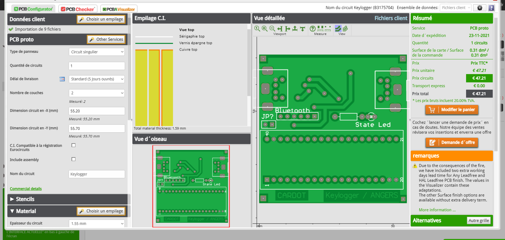

# Hardware Keylogger

This is a school project for the course "DEEP" at ESEO. The goal is to create a hardware keylogger that can hijack a PS/2 keyboard and store the keystrokes in a buffer & send them to a bluetooth device.

## Why a PS/2 keyboard ?

The PS/2 keyboard is a very simple device that can be easily hijacked.
The main difference with USB is the communication speed, PS/2 is much slower than USB.

To do the same thing with a USB keyboard we would need to use a microcontroller with a faster clock speed.

## Why a Hardware Keylogger ?

Because it's badass !

Joke aside, a hardware keylogger is a very simple device that can be easily hidden in a computer. It's also very hard to detect. Soft hacking is more and more complex and requires a lot of knowledge. Hardware hacking is much simpler and can be done by anyone.

The disadvantage of a hardware keylogger is that you have to place the device by yourself. Therefore it is much more risky !

## Warning

This project is for educational purpose only. I am not responsible for any damage caused by this project.

## Video Presentation

The video is in french but english subtitles are availables on Youtube.

Youtube link: [https://youtu.be/JonzK1D9_OE](https://youtu.be/JonzK1D9_OE)

<video src="assets/vid/Keylogger_Youtube.mp4" controls title="Title"></video>

## How to Install

Connect the PS/2 keyboard to the PS/2 port of the keylogger. Connect the keylogger to a computer using a PS/2 M/M cable. The keylogger will automatically start recording keystrokes.

## How to Uninstall

Just remove the keylogger and put the PS/2 keyboard back to the computer.

## How to Use

The keylogger is powered by the PS/2 port. It will automatically start recording keystrokes when plugged in. The red LED will light up when the keylogger is powered and the blue LED will blink when a keystroke is recorded.

### PCB

The PCB is designed with Altium Designer.

Euro Circuit PCB estimation : 

### Keystroke Listening

To develop the keylogger, the first step was to examinate the PS/2 communication protocol with an oscilloscope. The PS/2 protocol is very simple, it uses a clock signal and a data signal. The clock signal is generated by the keyboard and the data signal is generated by the keyboard and the computer. The keyboard sends data to the computer when the clock signal is low. The computer sends data to the keyboard when the clock signal is high.

Here on the image the clock signal is in blue and the data signal is in yellow.

